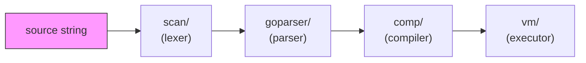
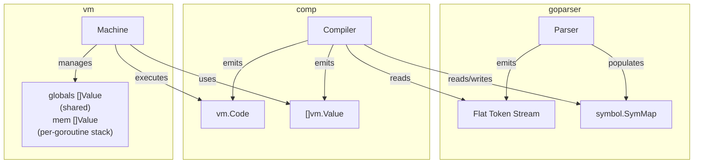

# Architecture Overview

Mvm interprets a subset of Go by piping source code through four stages:
lexing, parsing, compilation, and execution. Each stage is a standalone package
with a clean interface to the next.

## Pipeline



| Stage | Package | Input | Output |
|-------|---------|-------|--------|
| Lex | `scan/` | source string + `lang.Spec` | `[]scan.Token` |
| Parse | `goparser/` | scanner tokens | flat `goparser.Tokens` with Label/Goto/JumpFalse |
| Compile | `comp/` | flat token stream | `[]vm.Instruction` + `[]vm.Value` (data segment) |
| Execute | `vm/` | instructions + data | program output / return value |

The `interp/` package wires these stages together and provides incremental
evaluation (REPL support).

## Data flow



The parser and compiler share a single `symbol.SymMap`. The parser registers
types and function signatures; the compiler resolves addresses and emits
bytecode referencing data indices. Names resolve flatly on the compiler side
(`symAt` does no scope walk), so the parser bakes the resolved key into each
token. Type references go further: they carry the resolved `*vm.Type` itself, so
the compiler binds them to a global type slot by identity rather than by name
(see [ADR-020](decisions/ADR-020-type-identity-slots.md)).

## Memory model

The VM maintains two separate slices:

```
globals[0 .. dataLen-1]   global variable storage (module-level vars, func addresses)
mem[0 ..]                 call stack (grows upward; frame-relative indices only)
```

The split exists so that goroutines can share `globals` safely while each
goroutine runs its own private `mem` stack. Before the split, both lived in a
single `mem` slice, which made goroutine isolation impossible without copying.

Each call frame is laid out as:

```
[ ... args | deferHead | retIP | prevFP | locals ... ]
                                  ^
                                  fp points here (past deferHead, retIP, prevFP)
```

`frameOverhead = 3` accounts for the three bookkeeping slots:

- `deferHead` -- index of the topmost deferred-call record (0 = none).
- `retIP` -- packed `uint64`: `[frameBase:16 | nret:16 | retIP:32]`.
  Encodes the return address, number of return values, and frame size
  in a single slot, avoiding a separate metadata structure.
- `prevFP` -- the caller's frame pointer. The high bit (`heapSavedFlag`)
  indicates whether the caller's closure heap was saved to `heapFrames`.

A side-channel `heapFrames [][]*Value` slice saves caller closure heaps.
An entry is pushed only when the caller has a non-nil `heap` (closure calls);
plain function calls skip it entirely.
See [vm](modules/vm.md#call-frame) for details.

- `GetGlobal N` reads `globals[N]`
- `GetLocal N` reads `mem[fp - 1 + N]`

## Key design decisions

1. **No AST** -- the parser emits a flat token stream with control-flow
   encoded as `Label`/`Goto`/`JumpFalse` tokens. This eliminates a tree
   traversal pass and makes code generation a single linear walk.
   See [ADR-001](decisions/ADR-001-flat-token-stream.md).

2. **Hybrid Value** -- `vm.Value` stores numerics inline in a `uint64` field
   and composites in a `reflect.Value`. Arithmetic never allocates.
   See [ADR-002](decisions/ADR-002-hybrid-value.md).

3. **Scope as path** -- scopes are slash-separated strings
   (e.g. `main/foo/for0`), making symbol lookup a prefix walk.
   See [ADR-003](decisions/ADR-003-scope-as-path.md).

4. **Two-phase compilation with pre-allocated slots** -- compilation splits
   into a declaration phase and a code generation phase. Phase 1
   (declarations, retry loop, struct placeholders) lives in
   `goparser.ParseAll`; Phase 2 (code generation with pre-allocated data
   slots) lives in `comp.Compile`. Phase 1 uses a retry loop for forward
   references; Phase 2 uses topological sorting of var declarations to
   eliminate retries entirely. See [ADR-004](decisions/ADR-004-lazy-fixpoint.md).

5. **Per-type opcodes** -- all arithmetic opcodes are statically typed;
   there are no generic `Add`/`Sub`/`Mul`/`Neg`/`Greater`/`Lower` opcodes.
   12 numeric type variants per operation are selected at compile time via
   `NumKindOffset`. String concatenation uses the separate `AddStr` opcode.
   Immediate-operand variants fold `Push+BinOp` into one instruction.
   See [ADR-005](decisions/ADR-005-per-type-opcodes.md).

6. **Super instructions** -- the compiler fuses common multi-instruction
   sequences into single opcodes to reduce dispatch overhead. Three levels
   of fusion: `GetLocal+Op+Imm` (e.g. `GetLocalAddIntImm`),
   `Compare+Jump` (e.g. `LowerIntImmJumpFalse`), and triple fusion
   `GetLocal+Compare+Jump` (e.g. `GetLocalLowerIntImmJumpFalse`).
   See [ADR-007](decisions/ADR-007-super-instructions.md).

7. **Native Go interop** -- mvm functions are wrapped via `WrapFunc`
   and `reflect.MakeFunc` to be callable from native Go code. A `funcFields`
   side-table handles assignment to typed struct func fields.
   See [ADR-006](decisions/ADR-006-native-func-interop.md).

8. **Flat instruction encoding** -- `Instruction` is a fixed-size 16-byte
   struct `{Op Op; A, B int32; Pos Pos}` with two inline operands.
   This avoids heap-allocating an `[]int` arg slice per instruction and
   improves cache locality in the dispatch loop.

9. **Generics via monomorphization** -- generic functions and types are
   stored as token-level templates. Each instantiation (`Max[int]`,
   `Box[string]`) produces a specialized copy by textual substitution,
   then parses it through the normal path. No runtime type parameters,
   no new opcodes. See [ADR-011](decisions/ADR-011-generics-monomorphization.md).

10. **Synthetic `std` module for interpreted stdlib** -- the subset of
    Go's stdlib that mvm interprets from source (generic-first
    packages and pure-Go packages where bridges would lose interpreted
    methods) lives in a separate Go module
    (`github.com/mvm-sh/std`). mvm embeds a Go-proxy-format zip of it
    as an offline floor and resolves stdlib-shaped imports through
    `modfs` via a redirecting `fs.FS` (`stdlib/stdmod`). One pipeline
    serves both the embedded path and a network-fetched override.
    Performance-critical and hard-to-interpret packages stay as
    pre-compiled bridges in `stdlib/core`+`ext`. See
    [ADR-017](decisions/ADR-017-std-module-redirect.md).

11. **Type references carry identity, not names** -- a type is a first-class VM
    object (a slot in the `Data` segment). Type-reference tokens carry their
    resolved `*vm.Type`, and the compiler binds them to a shared type slot
    (`zeroTypeSlot`) by identity instead of re-resolving the name against the
    mutable shared symbol table. This decouples compile-time type correctness
    from symbol-table name state and is the foundation for robust generic
    instantiation. Method lookup stays name-keyed. See
    [ADR-020](decisions/ADR-020-type-identity-slots.md).

12. **Synthesized rtypes for native method dispatch** -- interpreted methods are
    attached to a hand-built Go rtype (`runtype`) so native reflect/`itab` dispatch
    calls them directly, with the method-shape stub pools in `stdlib/stubs`.
    This replaced the per-call interface-bridge + argument-proxy mechanism and
    the mvm-native stdlib shadows. See
    [ADR-021](decisions/ADR-021-synthesized-rtypes.md).

## Closure and interface dispatch

Closures capture variables via heap cells (`Closure{Code, Heap}`). Opcodes
`HeapAlloc`, `HeapGet`, `HeapSet`, `HeapPtr`, and `MkClosure` manage the capture
environment.

Interface dispatch uses an `Iface` wrapper holding a concrete type and value.
Methods are identified by integer IDs (`methodIDs` in the compiler).
`IfaceWrap` boxes a value; `IfaceCall` dispatches by method ID.

## Native method dispatch via synthesized rtypes

Go's `reflect.StructOf` cannot register methods on dynamically-created types,
so when an interpreted value with methods (e.g. `String() string`) is passed to
a native Go function like `fmt.Println`, Go's interface dispatcher cannot find
the method.

Mvm solves this by synthesizing a *real* Go rtype that carries the interpreted
methods, so native `itab`/reflect dispatch finds them directly with no per-call
wrapper. The machinery is split across two packages:

- **`runtype`** mirrors `internal/abi` byte-for-byte and overlays an
  `UncommonType` + method array onto a cloned layout rtype, wiring each method's
  `Ifn`/`Tfn` to a dispatch-stub PC. See [runtype](modules/runtype.md).
- **`stdlib/stubs`** holds the 16 method-signature *shapes* (S1 `func() string`
  ... S16 `UnmarshalXML`), the generated stub-function pools, and the
  per-shape dispatchers that re-enter the interpreter. See [stubs](modules/stubs.md).

`interp` attaches a synthesized rtype to every compiled type (`Machine.AttachSynthMethods`);
the vm-side glue in `vm/synth_bridge.go` matches each method signature to a
shape and builds the handler closure. See
[ADR-021](decisions/ADR-021-synthesized-rtypes.md).

This replaced the earlier per-call *interface bridge* + *argument proxy*
mechanism (ADR-009, ADR-012) and deleted ~1800 lines of mvm-native shadow
packages (`stdlib/jsonx`, `xmlx`, `gobx`). A type can now satisfy several
interfaces at once (`Stringer` *and* `json.Marshaler`), and native
reflect-walking code sees interpreted methods on nested struct fields with no
shadow.

The compiler still emits `IfaceWrap` for interface-typed arguments to native
calls, carrying the mvm `*Type` identity across the boundary (essential for
non-struct named types whose `reflect.Type` is shared with the underlying
type). `bridgeArgs` in `vm.Run` now only unwraps the `Iface` to its concrete
(synthesized) value, or retypes a pointer-to-interpreted-interface to the
synthesized interface rtype for `errors.As`.

The one surviving native-side hook is `RegisterNativeMethodHook` (`vm/bridge.go`):
it substitutes the result of a named method on a *native* receiver. The runtime
introspection bridge uses it for `(*runtime.Func).Name` / `FileLine` -- see
[vm.md](modules/vm.md#runtime-virtualization-bridges) and
[ADR-016](decisions/ADR-016-runtime-introspection-bridge.md).

## Variadic functions

Variadic parameters (`...T`) are parsed as `[]T` by `goparser`. At the call
site, the compiler emits `MkSlice` to pack trailing arguments into a slice
before `Call`. The callee sees a normal slice parameter.

## Built-in functions

Go builtins (`len`, `cap`, `append`, `copy`, `delete`, `new`, `make`,
`close`, `panic`, `recover`) and the mvm-specific `trap` debugger builtin
are registered in `symbol.SymMap` with `Kind: Builtin`.
The compiler intercepts them by name in `compileBuiltin()` and emits
dedicated opcodes rather than generating a function call. Because `Builtin`
symbols skip the `Get` instruction in the `Ident` handler, they have no
runtime value on the VM stack -- the compiler emits only the opcode that
performs the operation.

## Exception handling

`panic` sets a flag and unwinds the call stack. `defer` pushes a sentinel
frame with a `DeferRet` handler. `recover` clears the panic state inside a
deferred function.

A raw Go panic that escapes the VM (nil deref, divide by zero, an
explicit interpreted `panic`) is wrapped in a `vm.PanicError` captured
before the stack unwinds, so it renders a source snippet with a caret and
an `mvm stack:` trace that interleaves interpreted and reentrant native
frames. See [vm](modules/vm.md#panics-defer-recover-and-diagnostics).

## Process exit virtualization

Interpreted code that exits the process -- `os.Exit`, `log.Fatal*`, and
native bridges such as `testing.Main` -- must not terminate the host: it
would kill the REPL and leave embedders no catchable signal. The
interpreter rebinds those entry points so they `panic` an
`*interp.ExitError`, which the VM's recover path propagates unwrapped (it
implements the `vm.CleanExit` marker, distinct from a `PanicError`
crash). `Eval` returns it like any error; `errors.As` recovers the code;
the `mvm` CLI translates it back into a host `os.Exit(code)`. The same
mechanism lets `mvm test` drive `testing.MainStart(...).Run()` directly
and read back the exit code. See
[ADR-018](decisions/ADR-018-virtualized-process-exit.md),
[ADR-019](decisions/ADR-019-test-runner-mainstart-driver.md), and
[interp](modules/interp.md#process-exit-virtualization).

## Debug / trap support

Mvm provides an in-process debugger triggered by `trap()`, a builtin
that compiles to the `Trap` opcode. When the VM hits `Trap`, it pauses
execution and drops into an interactive REPL where the user can inspect the
call stack and memory.

The `Trap` opcode saves the resume address, syncs Machine state, and calls
`enterDebug()` inline. Defer return and panic unwinding use sentinel opcodes
(`DeferRet`, `PanicUnwind`) appended to the code array at `Run` entry.

Debug info (symbol names, source positions) is built lazily -- the
interpreter registers a builder function on the VM, and it is only called
when the first `trap()` fires. This avoids overhead for programs that never
use `trap`.

The same machinery is reused at runtime by introspection bridges:
`Machine.WalkCallStack` exposes the live frame chain to bridges,
`DebugInfo.FuncAt` resolves an IP to a function label, and
`SetActiveMachine` is the goroutine-cooperative slot that lets
bridges find the running VM across `makeCallFunc`-spawned runners. The
planned sampling profiler (see `project_profiler.md`) is expected to
reuse `WalkCallStack` and `DebugInfo` symbolization end-to-end.

See [vm](modules/vm.md#trap-and-interactive-debug-mode) for implementation
details and [vm](modules/vm.md#runtime-virtualization-bridges) for the
runtime bridge.

## Tracing

The VM can print a per-instruction trace in two modes, independently or
together:

- **line tracing** -- one entry per executed source line: the source position
  and the line text, indented by call depth, with consecutive hits at the same
  position deduplicated.
- **op tracing** -- one entry per executed instruction: `ip`/`sp`/`fp`, the
  opcode and its immediate operand, and a snapshot of the top stack slots.

Both reuse the lazily built `DebugInfo` (`PosToLine` and the source text map) --
the same machinery the `trap` debugger uses, so there is no extra bookkeeping in
the common path. Before the `Run` loop the Machine hoists the trace state into a
register, so when tracing is off the per-instruction cost is a single
compare-against-zero; the per-instruction work itself lives in `traceStep` and
`traceOp` in `vm/vm.go`.

The user-facing surface -- the `-x` flag and the `MVM_TRACE` environment
variable -- is parsed by `interp.ParseTraceModes`, which both share. See
[usage.md](usage.md#execution-tracing) for the mode syntax and sample output.
