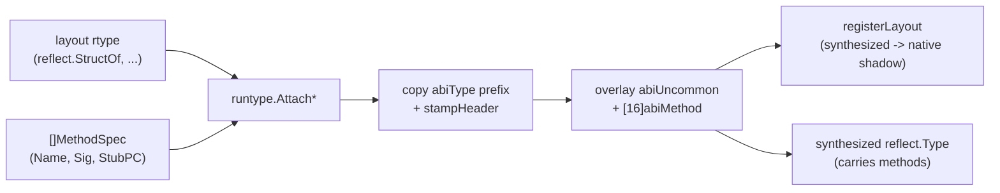

# runtype

> Synthesizes Go rtypes that carry interpreted-method metadata, so native
> reflect/itab dispatch can call interpreter methods directly.

## Overview

`runtype` (Go runtime types) is the low-level half of mvm's native method-dispatch
mechanism (see [ADR-021](../decisions/ADR-021-synthesized-rtypes.md)).
Go cannot attach methods to a `reflect.StructOf`-built type, so `runtype` builds a
fresh rtype by hand -- mirroring `internal/abi` layouts byte-for-byte -- and
overlays an `UncommonType` + method array whose dispatch entries point at
pre-built stub PCs.
It sits beside the pipeline rather than in it: the interpreter calls into `runtype`
(via `stdlib/stubs`) after a type's methods are known.

`runtype` deliberately carries no knowledge of method *shapes* or handlers.
`Attach*` take a `MethodSpec` with an already-resolved stub PC; the shape
catalog and stub pools live in [stubs](stubs.md), which imports `runtype`
one-directionally.

## Key types and functions

- **`MethodSpec`** -- `{Name, Exported, Sig, StubPC}`. One method to install;
  `StubPC` is the dispatch-stub entry PC the caller resolved from the shape.
- **`AttachMethods(layout, name, pkg, []MethodSpec)`** -- dispatcher that routes
  to the kind-specific synthesizer below.
- **`AttachStructMethods` / `AttachPrimitiveMethods` / `AttachSliceMethods` /
  `AttachArrayMethods` / `AttachMapMethods`** -- clone `layout` and attach the
  methods on the value type `T`.
- **`AttachPtrMethods(elem, ...)`** -- synthesize `*T` with the methods and wire
  `elem.PtrToThis` so `reflect.PointerTo(elem)` returns this method-bearing `*T`.
- **`Clone(layout, pkg)`** -- methodless clone with its own identity (fresh hash,
  separate `PtrToThis`); registers its layout so the derive constructors work.
- **`InterfaceOf(name, pkg, []Imethod)`** -- a method-bearing interface rtype
  used as a *satisfaction target* (e.g. for `errors.As` against an anonymous
  interface); methods live inline, no stub pool.
- **Derived constructors** `PointerTo` / `SliceOf` / `ArrayOf` / `ChanOf` /
  `MapOf` -- analogs of `reflect.PointerTo` etc. that work on synthesized-rtype
  elems via a layout-shadow registry (`reflect.*Of` crashes on them).
- **`IsSynth` / `HasPtrToThis` / `SamePtrLayout` / `StampName` /
  `PatchStructField`** -- predicates and in-place mutators the vm cascade uses.
- **`FuncPC(fn)`** -- entry PC of a func value; exported for the `stubs` pools.

## Internal design

A synthesized rtype is a typed Go struct (so the GC sees its pointer fields) holding a
copy of the source `abiType` prefix, an `abiUncommon`, and a `[16]abiMethod`
array (`maxMethods`). `stampHeader` gives it a fresh hash, a restamped `Str`
(via `addReflectOff`), and clears `tflagExtraStar`; `installMethods` sorts
methods by name (reflect's method lookup needs sorted order) and writes each
method's `Ifn`/`Tfn` to its stub PC.

Key files: `abi.go` (the `internal/abi` mirror, validated by `abi_test.go`),
`linkname.go` (`addReflectOff`, `rtypePtr`, `asReflectType`), `name.go`
(`encodeName`, hand-rolled to avoid linknaming `reflect.newName`), `hash.go`,
`funcpc.go`, `clone.go`, `derive.go` (constructors + the `synthesized -> native
layout` registry that lets derivations nest), `attach*.go`, `interface.go`.

Uncommon-type offset is per-kind (pointer/slice/chan use a 56-byte
`PtrType+UncommonType` layout; primitives use 48) and must match the runtime's
`Uncommon()` dispatch, or the method walk reads garbage.

## Dependencies

- Standard library only: `reflect`, `unsafe`, `sync`, `sync/atomic`,
  `errors`/`fmt`/`sort`. No internal mvm imports.
- Consumed by `vm/` (`vm/type.go` for the derive/predicate helpers,
  `vm/synth_bridge.go` for `Clone`/`InterfaceOf`) and by `stdlib/stubs`
  (`FuncPC` + the `Attach*` entry points).

## Open questions / TODOs

- `abi.go` mirrors unexported runtime layouts; bump and re-run `abi_test.go`
  on each Go release. <!-- TODO: verify drift on go1.27 -->
- `Type.Method(i).Func.Call` does not work for non-direct kinds (natural-ABI
  receiver); the common interface-dispatch path does.
- Synthesized rtypes are never freed, so they pollute the process `itab` cache
  (REPL redefinition leaks).
