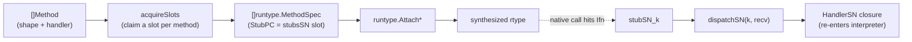

# stdlib/stubs

> The method-signature "shape" catalog and dispatch-stub pools that let
> synthesized rtypes route interpreted method calls back into the interpreter.

## Overview

`stdlib/stubs` is the upper half of mvm's native method-dispatch mechanism (see
[ADR-021](../decisions/ADR-021-synthesized-rtypes.md)); [runtype](runtype.md) is the
lower half.
A synthesized rtype needs each method's `Ifn`/`Tfn` to point at a real Go
function PC.
`stubs` pre-generates pools of such functions, one pool per method-signature
*shape*, and pairs each pool with a dispatcher that forwards the call to a
per-slot handler closure (which re-enters the interpreter).
Two kinds of shape coexist: the per-signature *typed* shapes below, and the ABI
*word-class* shapes ([ADR-022](../decisions/ADR-022-word-class-dispatch.md)) that
let one pool serve many signatures.

The package exists separately from `runtype` to break an import cycle: `runtype.Attach*`
need a resolved stub PC, while the stub pools need `runtype.FuncPC`.
Inverting the attach API (PC-based `runtype.MethodSpec`) lets `stubs` depend on
`runtype` one-directionally instead.

## Key types and functions

- **`Shape`** + **`ShapeS1` ... `ShapeS38`** -- the catalog of supported method
  signatures. A few representatives:

  | Shape | Signature | Covers |
  |-------|-----------|--------|
  | S1 | `func() string` | `Stringer`, `error`, `GoStringer`, `flag.Value.String` |
  | S2 / S3 | `func() ([]byte, error)` / `func([]byte) error` | `json`/`text`/`binary` Marshal/Unmarshal |
  | S4 / S5 / S6 / S7 | `Is`/`As`/`Unwrap` shapes | `errors.Is`/`As`/`Unwrap` |
  | S8 / S9 / S10 | `Len`/`Less`/`Swap` | `sort.Interface` |
  | S11 / S12 | `Push`/`Pop` | `heap.Interface` |
  | S13 | `func([]byte) (int, error)` | `io.Reader`/`io.Writer` |
  | S14 | `func(fmt.State, rune)` | `fmt.Formatter` |
  | S15 / S16 | `MarshalXML`/`UnmarshalXML` | `xml.Marshaler`/`Unmarshaler` |
  | S22 ... S31 | `fs` method shapes | `fs.FileInfo`, `fs.DirEntry`, `fs.FS` and friends |
  | S32 ... S36 | `slog` method shapes | `slog.Handler`, `slog.LogValuer` |
  | S37 | `func() (rune, int, error)` | `io.RuneReader` |
  | S38 | `func()` | niladic marker methods |

- **`Method`** -- `{Name, Exported, Sig, Shape, Handler, WordKey, Core}`. The
  shape-carrying input the vm builds. For a typed shape, `Handler` is the matching
  `HandlerS*` closure; for the word-class path, a non-empty `WordKey` names the
  generated word-shape pool and `Core` is the marshaling closure (`Shape`/`Handler`
  ignored).
- **`HandlerS1` ... `HandlerS38`** -- per-shape handler function types.
- **`CoreFunc`** -- the word-class marshaling closure type, `func(recv
  unsafe.Pointer, pw []unsafe.Pointer, sw []uint64, rpw []unsafe.Pointer, rsw
  []uint64)`; the vm supplies it, the generated dispatcher calls it.
- **`Attach{Methods,StructMethods,PrimitiveMethods,SliceMethods,ArrayMethods,
  MapMethods,PtrMethods}`** -- mirror the `runtype.Attach*` entry points but accept
  `[]Method`; each resolves every method's shape (typed or word-class) to a free
  stub slot, then calls `runtype`.
- **`HasWordShape`** -- reports whether a generated word-shape pool exists for a
  key, so the vm drops (not errors on) an unsupported word-shape.
- **`SlotsUsedS1` ... `SlotsUsedS38`** -- slot-pool usage counters (for tests /
  metrics).
- **`HighWater`** -- per-pool slot high-water vs capacity (typed and word
  shapes). `mvm` dumps it on exit when `MVM_POOLSTATS` is set; use it to
  right-size pools, since each slot is one generated function and the whole
  package compiles ~50k of them (under `-race` that roughly triples compiler
  memory, so `make fast` lowers `GOGC` for the build).

## Internal design

Each shape `SN` has two files:

- `pool_sN.go` (generated by `gen_pools.go`, `//go:build !wasm`) -- the stub
  functions `stubSN_k(recv, ...) { dispatchSN(k, recv, ...) }` and a `stubsSN`
  array of their PCs (`runtype.FuncPC`). One stub per slot; the Go compiler emits
  the correct ABI, so no assembly is needed. The pool size `poolSizeSN` lives in
  the generated `sizes.go`. The whole pool is native-only (see "wasm" below).
- `registry_sN.go` (hand-written) -- a slot pool of `HandlerSN`, an
  `acquireSlotSN` that claims the next free slot, and `dispatchSN(slot, ...)`
  that looks up and invokes the handler.

Slots are claimed monotonically and never reclaimed (the per-shape counter has
no safe decrement under concurrent attaches); `release` only nils a slot's
handler to free its closure captures.
S1 carries 3072 slots (Stringer/Error are the most-attached shape) and S38 5120
(protobuf markers); the rest default to 256.

### wasm carries no pools (shared-PC dispatch)

Every slot is one generated function, so the ~53k of them were about half the wasm
binary. The wasm target carries **none** of them: all `pool_*.go` are
`//go:build !wasm`. This is sound because on the all-interpreted wasm target no
native caller dispatches an interpreted method through an itab or native-internal
reflect -- interpreted code uses `IfaceCall`, and interpreted reflect is
intercepted by the vm (`reflectValueShim`/`reflectTypeShim`). So the stub PC is
never invoked; it exists only so the synth rtype carries a method set for reflect
introspection (`Implements`/`NumMethod`/`MethodByName`), which read method
name/signature metadata, not the PC.

The wasm build therefore wires every method's `Ifn`/`Tfn` to one shared trap PC:
`stubs.FillMethods` (`fill_wasm.go`) points them all at `sharedStub`, which panics
if ever reached (i.e. if interpreted-method dispatch is ever attempted from native
code -- which means a package that should have been interpreted is still a native
bridge). On the vm side, `vm.synthSharedPC` (build-tagged) makes `resolveDispatch`
attach every method regardless of shape and skips handler/word-core building.
`arrays_wasm.go` declares the empty `stubsSN` arrays so the hand-written
`registry_sN.go` still compile on wasm; they are unreachable and the linker drops
them. This cuts the wasm binary ~30 MB (68.8 -> 39 MB). Native dispatch is
unchanged -- it still uses the full per-signature pools. See
[ADR-022](../decisions/ADR-022-word-class-dispatch.md).

This is the first step of removing stubs on wasm; it only pays off once the
method-dispatching stdlib packages (`fmt`, `encoding/*`, `sort`, ...) are
interpreted from source rather than bridged, so no native caller hits the trap.

### Word-class shapes

The typed shapes above need one hand-written `registry_sN.go` per Go signature.
The *word-class* shapes ([ADR-022](../decisions/ADR-022-word-class-dispatch.md))
key on the method's ABI register words instead, so one pool serves every signature
that classifies the same way (`Equal(StructA) bool` over an interpreted
two-word struct and any other `func(ptr-word, int-word) int-word` share `pi_i`).
The catalog is `wordShapes` in `gen_pools.go`, and `emitWord` generates a
`pool_w*.go` per shape -- the same stub-pool layout as the typed shapes, but with
one *generic* dispatcher: it scatters the native register words into `pw`
(pointer words, a typed `[]unsafe.Pointer` so the GC scans them) and `sw` (integer
words), calls the per-slot `CoreFunc`, then gathers the result words back out.
The `CoreFunc` -- built by the vm (`Machine.makeWordCore`) -- does the
reflect-driven value<->word marshaling and owns the error policy.
`registerWordPool` records each generated pool in a `sync.Map` keyed by the
word-shape (`acquireWordSlot`/`HasWordShape` read it); the vm computes the same
key independently via `detectWordShape`.
The path is gated to 64-bit little-endian targets; on 32-bit or big-endian targets
only the typed shapes attach.
On wasm (also 64-bit LE but a stack ABI, not registers) the vm classifies and
marshals by 8-byte stack slots instead of register words, packing sub-word struct
fields; the generated pools are arch-agnostic source and shared (see ADR-022).

The vm-side glue is *not* here -- `vm/synth_bridge.go` owns `detectShape`
(signature -> `Shape`) and `makeHandlerS*`, plus `detectWordShape` (signature ->
word-shape key) and `makeWordCore` for the word path, because those need
`Machine`/`Iface`/`Type`.
A method is matched to a typed shape first and only falls back to the word path,
so the faster, error-aware typed handlers win where they apply.

## Dependencies

- [runtype](runtype.md) -- `FuncPC` (pools) and the `Attach*` synthesizers (wrappers).
- Standard library: `reflect`, `unsafe`, `sync/atomic`, plus the packages the
  shaped signatures mention (`fmt`, `encoding/xml`, `io/fs`, `time`, `context`,
  `log/slog`).
- Consumed by `vm/synth_bridge.go` (`Shape`/`Method`/`HandlerS*`/`Attach*`).

Regenerate the pools with `go generate ./stdlib/stubs/` (or `make generate`)
after editing the shape catalog in `gen_pools.go`.

## Open questions / TODOs

- Pools are finite; a process attaching more distinct methods of one shape than
  its pool holds errors out (`stubs: shape SN stub pool exhausted`). Sizes are a
  static guess tuned to the test suite, with the wasm build deliberately smaller
  (see "Pool sizes and the wasm binary" above).
- A new *typed* shape is append-only edits to `gen_pools.go` + a hand-written
  `registry_sN.go` + a `makeHandlerSN`/`detectShape` case in `vm/synth_bridge.go`;
  an ABI-compatible signature needs none of that and rides an existing word-shape.
- Under the register ABI the word path carries `float64` (`f`), `complex128`
  (`ff`), `float32` (`g`, a single-precision FP-register word, distinct stub from
  `f`), `complex64` (`gg`), and sub-word-packed structs, but drops arrays of length
  > 1 and signatures over the arch's register budget. The wasm/ABI0 path has no
  budget and carries every type as stack bytes (float32 as raw `i` bytes, so its
  key differs from the register `g`), dropping only on a missing pool. The path is
  disabled entirely on non-64-bit or big-endian targets.
- The word-shape catalog is hand-curated (full enumeration would explode), so
  growing it is guided by telemetry: run with `MVM_WORDDROPS=1` and the process
  reports, at exit, every signature `detectWordShape` dropped -- a "missing pools"
  list of word-shapes to add, plus an "unsupported" list (arrays / over budget).
