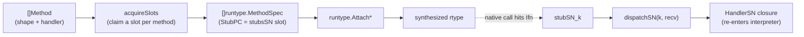

# stdlib/stubs

> The method-signature "shape" catalog and dispatch-stub pools that let
> synthesized rtypes route interpreted method calls back into the interpreter.

## Overview

`stdlib/stubs` is the upper half of mvm's native method-dispatch mechanism (see
[ADR-021](../decisions/ADR-021-synthesized-rtypes.md)); [runtype](runtype.md) is the
lower half.
A synthesized rtype needs each method's `Ifn`/`Tfn` to point at a real Go
function PC.
`stubs` pre-generates pools of such functions, one pool per method-signature
*shape*, and pairs each pool with a dispatcher that forwards the call to a
per-slot handler closure (which re-enters the interpreter).

The package exists separately from `runtype` to break an import cycle: `runtype.Attach*`
need a resolved stub PC, while the stub pools need `runtype.FuncPC`.
Inverting the attach API (PC-based `runtype.MethodSpec`) lets `stubs` depend on
`runtype` one-directionally instead.

## Key types and functions

- **`Shape`** + **`ShapeS1` ... `ShapeS16`** -- the catalog of supported method
  signatures. A few representatives:

  | Shape | Signature | Covers |
  |-------|-----------|--------|
  | S1 | `func() string` | `Stringer`, `error`, `GoStringer`, `flag.Value.String` |
  | S2 / S3 | `func() ([]byte, error)` / `func([]byte) error` | `json`/`text`/`binary` Marshal/Unmarshal |
  | S4 / S5 / S6 / S7 | `Is`/`As`/`Unwrap` shapes | `errors.Is`/`As`/`Unwrap` |
  | S8 / S9 / S10 | `Len`/`Less`/`Swap` | `sort.Interface` |
  | S11 / S12 | `Push`/`Pop` | `heap.Interface` |
  | S13 | `func([]byte) (int, error)` | `io.Reader`/`io.Writer` |
  | S14 | `func(fmt.State, rune)` | `fmt.Formatter` |
  | S15 / S16 | `MarshalXML`/`UnmarshalXML` | `xml.Marshaler`/`Unmarshaler` |

- **`Method`** -- `{Name, Exported, Sig, Shape, Handler}`. The shape-carrying
  input the vm builds; `Handler` is the matching `HandlerS*` closure.
- **`HandlerS1` ... `HandlerS16`** -- per-shape handler function types.
- **`Attach{Methods,StructMethods,PrimitiveMethods,SliceMethods,ArrayMethods,
  MapMethods,PtrMethods}`** -- mirror the `runtype.Attach*` entry points but accept
  `[]Method`; each resolves every method's shape to a free stub slot, then calls
  `runtype`.
- **`SlotsUsedS1` ... `SlotsUsedS16`** -- slot-pool usage counters (for tests /
  metrics).

## Internal design

Each shape `SN` has two files:

- `pool_sN.go` (generated by `gen_pools.go`) -- `poolSizeSN` stub functions
  `stubSN_k(recv, ...) { dispatchSN(k, recv, ...) }` and a `stubsSN` array of
  their PCs (`runtype.FuncPC`). One stub per slot; the Go compiler emits the
  correct ABI, so no assembly is needed.
- `registry_sN.go` (hand-written) -- a slot pool of `HandlerSN`, an
  `acquireSlotSN` that claims the next free slot, and `dispatchSN(slot, ...)`
  that looks up and invokes the handler.

Slots are claimed monotonically and never reclaimed (the per-shape counter has
no safe decrement under concurrent attaches); `release` only nils a slot's
handler to free its closure captures.
S1 carries 2048 slots (Stringer/Error are the most-attached shape); the rest
default to 256.

The vm-side glue is *not* here -- `vm/synth_bridge.go` owns `detectShape`
(signature -> `Shape`) and `makeHandlerS*` (builds the closure that calls
`Machine.CallFunc`), because those need `Machine`/`Iface`/`Type`.

## Dependencies

- [runtype](runtype.md) -- `FuncPC` (pools) and the `Attach*` synthesizers (wrappers).
- Standard library: `reflect`, `unsafe`, `sync/atomic`, plus `fmt`/`encoding/xml`
  for the S14/S15/S16 stub signatures.
- Consumed by `vm/synth_bridge.go` (`Shape`/`Method`/`HandlerS*`/`Attach*`).

Regenerate the pools with `go generate ./stdlib/stubs/` (or `make generate`)
after editing the shape catalog in `gen_pools.go`.

## Open questions / TODOs

- Pools are finite; a process attaching more distinct methods of one shape than
  its pool holds errors out (`stubs: shape SN stub pool exhausted`). Sizes are a
  static guess tuned to the test suite.
- New shapes are append-only edits to `gen_pools.go` + a hand-written
  `registry_sN.go` + a `makeHandlerSN`/`detectShape` case in `vm/synth_bridge.go`.
