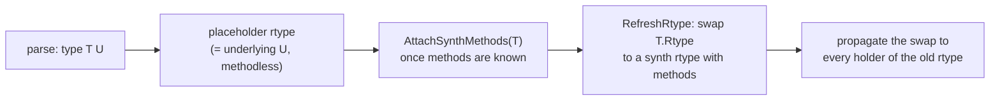

# synth-types

> How interpreted types become real `reflect.Type`s, and the invariants that
> keep the symbolic and runtime identities in sync.

## Overview

This is a cross-cutting concern, not a single package.
The mechanism is split across [runtype](runtype.md) (low-level rtype
fabrication), [stdlib/stubs](stubs.md) (method shapes + dispatch stubs),
`vm/type.go` + `vm/synth_bridge.go` (the `*Type` model and the attach cascade),
and `comp/compiler.go` (the post-attach refresh sweeps).
This page explains the *system* those pieces form and the rules they must obey.
See also [ADR-021](../decisions/ADR-021-synthesized-rtypes.md) (why we synthesize
rtypes) and [ADR-020](../decisions/ADR-020-type-identity-slots.md) (keying type
references on identity, not name).

## The core tension

Mvm is a bytecode interpreter running inside a statically-compiled Go process.
Interpreted types (`type Animal int`, user structs) only exist at mvm runtime.
But the moment an interpreted value crosses into native stdlib (`json.Marshal`,
`sort.Sort`, `fmt`, `reflect`) it must be backed by a real `reflect.Type` the
host runtime accepts.
Go offers no API to mint a named type with methods after link time, so we
fabricate one.
Almost every type bug is a consequence of retrofitting runtime type-creation
onto a runtime that assumes all types are known at link time.

## The two identities

Mvm maintains a second, dynamic type system and continuously projects it onto
the host's static one.

| | symbolic identity | runtime identity |
|---|---|---|
| representation | `*vm.Type` | `reflect.Type` (a `*abi.Type` / rtype) |
| owner | us | the Go runtime |
| carries | `Base`, `ElemType`/`KeyType`, `derived` cache, `Methods`, `Fields`, `Placeholder` | layout, GC pointer map, method table, name offsets |
| used for | parse/compile decisions, dedup, the cascade | native dispatch, assignability, GC |

The guiding rule ([ADR-020](../decisions/ADR-020-type-identity-slots.md)) is that
`*vm.Type` is the source of truth and `reflect.Type` is a *derived output*: never
key compile-time decisions on a `reflect.Type`.
Where the two drift apart is where bugs live.

## The placeholder lifecycle

A type's methods are usually unknown at parse time (forward references; methods
declared after the type).
So the projection happens in two steps.

The swap in the final step is the single largest source of bugs: any holder of
the old placeholder rtype that does not get the memo is left desynced.

## Runtime invariants

These are the rules the host runtime imposes.
Each past bug class is a violation of one of them.

- **C1 -- Layout invariance.**
  A fabricated or in-place-patched rtype must preserve Size, Align, PtrBytes, and
  the GC pointer map (`GCData`) exactly.
  The collector walks every heap value by its rtype's pointer bitmap; a wrong map
  yields `runtime: bad pointer` crashes.
  This is why synth clones a real *layout shadow* rather than building from
  scratch, why `runtype.SamePtrLayout` gates every in-place patch, and why
  patching a slice *element* is always safe (the slice header is
  element-independent) while struct-field / array / map patches need the guard.

- **C2 -- Name/offset resolution.**
  `Str` and `PtrToThis` are offsets resolved relative to a module's data section.
  Synth rtypes live outside any moduledata, so calling raw
  `reflect.PointerTo/SliceOf/StructOf` on one crashes in `resolveNameOff`
  ("name offset base pointer out of range").
  We register names via the linknamed `reflect.addReflectOff` and route all
  derivation through `runtype.PointerTo/SliceOf/MapOf/...`, branching on
  `runtype.IsSynth` (native elem keeps reflect identity; synth elem uses the
  safe builder).

- **C3 -- Identity and dedup discipline.**
  reflect dedups types *structurally* and caches globally (`StructOf`/`MapOf`/
  `SliceOf`), and assignability for named types is by *identity*, not structure
  (`map[int]bool` is not assignable to `map[TI]bool`).
  Two consequences: a fabricated rtype can be silently shared across parallel
  Interps (the `structTypesMu` race -- an in-place patch must hold the same lock
  `StructOf` reads under), and a placeholder rtype can alias a real type
  (`[]TI`-placeholder == `[]int`).
  The discipline: one canonical `*vm.Type` per shape, derived types memoized
  per-`*vm.Type`, and never let a clone share another type's `derived` cache.

- **C4 -- Method-table ABI.**
  Methods are text-segment function pointers in the rtype's uncommon area; our
  stubs ([stubs](stubs.md)) trampoline back into the interpreter.
  A stub's ABI must match how native code invokes the method.
  The open `Tfn`/`Ifn` gap (natural-ABI value receivers vs the boxed-pointer
  convention) is a C4 limitation -- it is why `reflect.Method.Func.Call` on a
  non-direct kind can still misbehave.

- **C5 -- Pinning and lifetime.**
  `addReflectOff` pins synth rtypes process-wide forever; reflect's offset table
  holds them and they are never collected.
  So the stub pools must be bounded and slot reclamation is unsound -- a freed
  slot's baked-in stub PC would later dispatch a different type's method.

## Keeping the projection in sync

When a placeholder is upgraded, the swap must reach every holder of a reference
to the old rtype.
There are four kinds of holder, each with its own propagation mechanism.

| Holder froze the placeholder in... | Propagation mechanism | Lives in |
|---|---|---|
| compile-time data slots (Fnew sources, type descriptors, var storage) | `RefreshSynthRtype` re-emits the slot | `comp/compiler.go` |
| derived types reachable from the canonical root (`*T`, `[]T`, `map[T]V`) | `RefreshRtype` cascade rebuilds via `runtype.*` | `vm/type.go` |
| references embedded in another rtype (struct fields; named-slice elem) | in-place patch (`PatchSynthStructFields`, `PatchSynthSliceElem`) | `vm/type.go` + `comp` sweep |
| values built at runtime (`make` map key/elem) | capture the canonical `*vm.Type` at emit (`makeKeyType` / `makeElemType`) | `comp/compiler.go` |

A fifth failure mode is the inverse: an illegitimately *shared* `derived` cache
propagates an upgrade across two distinct symbolic identities.
The fix is to not share it -- `(*Type).ResetDerived()` on the clone, since a
defined type is distinct from its underlying.

The sweeps run in order from `interp/synth.go` after the per-type attach cascade:
`RebuildSynthStructRtypes` -> `RebuildSynthSliceRtypes` -> `RefreshSynthRtype`.

## Rebuild vs patch

When a referenced element upgrades, a container can be rebuilt or patched in
place; the choice recurs throughout the cascade.

- **Rebuild** (`runtype.SliceOf(newElem)`) yields a fresh, correct rtype, but
  gives it a *new identity* and *drops any methods* attached to the container.
- **Patch** (`runtype.PatchSliceElem`, `PatchStructField`) preserves identity and
  attached methods, but is layout-constrained (C1) and mutates shared state (C3).

Rule of thumb: patch when methods or identity must survive (a named `ByAge
[]Person` with its own `sort.Interface` methods; a struct rtype with a wired
`PtrToThis`); rebuild when the container is anonymous and identity can float
(the canonical `[]Person` in the derived cascade).

## Open questions / TODOs

- C6 (the aspirational invariant): make `*vm.Type` the *only* compile-time
  identity so the placeholder + refresh + patch machinery can be deleted.
  Tracked under [ADR-020](../decisions/ADR-020-type-identity-slots.md); the
  remaining drift is where parse/compile still reach for a `reflect.Type`.
- C4: the `Tfn`/`Ifn` natural-ABI gap (see [runtype](runtype.md)).
- C5: synth rtypes leak on REPL redefinition (never freed).
