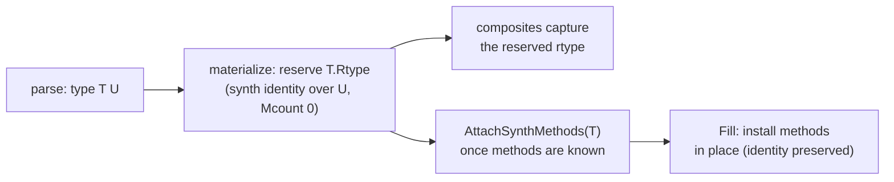

# synth-types

> How interpreted types become real `reflect.Type`s, and the invariants that
> keep the symbolic and runtime identities in sync.

## Overview

This is a cross-cutting concern, not a single package.
The mechanism is split across [runtype](runtype.md) (low-level rtype
fabrication), [stdlib/stubs](stubs.md) (method shapes + dispatch stubs),
`vm/type.go` + `vm/derive.go` + `vm/synth_bridge.go` (the `*Type` model, the
reserve gate, and the attach/fill step), and `comp/compiler.go` (materialize-time
reservation + deferred slot fill).
This page explains the *system* those pieces form and the rules they must obey.
See also [ADR-021](../decisions/ADR-021-synthesized-rtypes.md) (why we synthesize
rtypes) and [ADR-020](../decisions/ADR-020-type-identity-slots.md) (keying type
references on identity, not name).

## The core tension

Mvm is a bytecode interpreter running inside a statically-compiled Go process.
Interpreted types (`type Animal int`, user structs) only exist at mvm runtime.
But the moment an interpreted value crosses into native stdlib (`json.Marshal`,
`sort.Sort`, `fmt`, `reflect`) it must be backed by a real `reflect.Type` the
host runtime accepts.
Go offers no API to mint a named type with methods after link time, so we
fabricate one.
Almost every type bug is a consequence of retrofitting runtime type-creation
onto a runtime that assumes all types are known at link time.

## The two identities

Mvm maintains a second, dynamic type system and continuously projects it onto
the host's static one.

| | symbolic identity | runtime identity |
|---|---|---|
| representation | `*vm.Type` | `reflect.Type` (a `*abi.Type` / rtype) |
| owner | us | the Go runtime |
| carries | `Base`, `ElemType`/`KeyType`, `derived` cache, `Methods`, `Fields`, `Placeholder` | layout, GC pointer map, method table, name offsets |
| used for | parse/compile decisions, dedup, reservation | native dispatch, assignability, GC |

The guiding rule ([ADR-020](../decisions/ADR-020-type-identity-slots.md)) is that
`*vm.Type` is the source of truth and `reflect.Type` is a *derived output*: never
key compile-time decisions on a `reflect.Type`.
Where the two drift apart is where bugs live.

## The placeholder lifecycle

A type's methods are usually unknown at parse time (forward references; methods
declared after the type).
So the projection happens in two steps, but with a **stable identity**: the
type's synth rtype is *reserved* (allocated with an empty method table) at
materialize, and the methods are *filled into it in place* at attach. Because the
identity never changes, any composite that captured the reserved rtype before
attach observes the methods afterward with no propagation.

This replaced an earlier design that *swapped* `T.Rtype` to a fresh method-bearing
rtype at attach and then cascaded the swap to every holder of the old rtype --
the single largest historical source of type bugs, now retired (see history
below).

## Runtime invariants

These are the rules the host runtime imposes.
Each past bug class is a violation of one of them.

- **C1 -- Layout invariance.**
  A fabricated or in-place-patched rtype must preserve Size, Align, PtrBytes, and
  the GC pointer map (`GCData`) exactly.
  The collector walks every heap value by its rtype's pointer bitmap; a wrong map
  yields `runtime: bad pointer` crashes.
  This is why synth clones a real *layout shadow* rather than building from
  scratch, why `runtype.SamePtrLayout` gates every in-place patch, and why
  patching a slice *element* is always safe (the slice header is
  element-independent) while struct-field / array / map patches need the guard.

- **C2 -- Name/offset resolution.**
  `Str` and `PtrToThis` are offsets resolved relative to a module's data section.
  Synth rtypes live outside any moduledata, so calling raw
  `reflect.PointerTo/SliceOf/StructOf` on one crashes in `resolveNameOff`
  ("name offset base pointer out of range").
  We register names via the linknamed `reflect.addReflectOff` and route all
  derivation through `runtype.PointerTo/SliceOf/MapOf/...`, branching on
  `runtype.IsSynth` (native elem keeps reflect identity; synth elem uses the
  safe builder).

- **C3 -- Identity and dedup discipline.**
  reflect dedups types *structurally* and caches globally (`StructOf`/`MapOf`/
  `SliceOf`), and assignability for named types is by *identity*, not structure
  (`map[int]bool` is not assignable to `map[TI]bool`).
  Two consequences: a fabricated rtype can be silently shared across parallel
  Interps (the `structTypesMu` race -- an in-place patch must hold the same lock
  `StructOf` reads under), and a placeholder rtype can alias a real type
  (`[]TI`-placeholder == `[]int`).
  The discipline: one canonical `*vm.Type` per shape, derived types memoized
  per-`*vm.Type`, and never let a clone share another type's `derived` cache.

- **C4 -- Method-table ABI.**
  Methods are text-segment function pointers in the rtype's uncommon area; our
  stubs ([stubs](stubs.md)) trampoline back into the interpreter.
  A stub's ABI must match how native code invokes the method.
  The open `Tfn`/`Ifn` gap (natural-ABI value receivers vs the boxed-pointer
  convention) is a C4 limitation -- it is why `reflect.Method.Func.Call` on a
  non-direct kind can still misbehave.

- **C5 -- Pinning and lifetime.**
  `addReflectOff` pins synth rtypes process-wide forever; reflect's offset table
  holds them and they are never collected.
  So the stub pools must be bounded and slot reclamation is unsound -- a freed
  slot's baked-in stub PC would later dispatch a different type's method.

## Keeping the projection in sync

Because the synth identity is reserved at materialize and methods are filled into
it in place, *there is nothing to propagate*: every holder -- a compile-time data
slot, a derived `*T`/`[]T`/`map[T]V`, a struct field, a `make`d value -- captures
the final reserved rtype directly, and the in-place fill is invisible to them.

This rests on the reservation existing *before* anything captures the identity.
The reserve gate lives in `vm/derive.go` (`maybeReserve` for non-struct kinds,
`maybeReserveStruct` for structs; `hasReservableMethods` decides), driven from
`MaterializeRtype`. For that gate to fire, the type's methods must be known when
it is first materialized:

- **`comp.preregisterMethods`** populates each receiver type's method table (by
  signature) before any body compiles, so a type materialized during body compile
  already counts as method-bearing.
- **`comp.materializeIfaceMethods`** fills interface method signatures *after* the
  pre-pass, so a named type referenced only in an interface signature (e.g.
  `Coverage.Regions() []Region`) reserves rather than being stamped methodless.
- **`comp.propagateEmbeddedMethods`** runs once before body compile (for embedded
  interfaces) and once after (for embedded value methods).

Deferred compile-time type slots are the one thing settled post hoc:
`Compiler.FillTypeSlots` (called from `interp/synth.go` after attach) writes each
deferred `c.Data` slot to its type's now-final `Rtype`. No re-emit or rebuild is
involved -- the rtype is already correct, the slot just had not been written.

A failure mode to avoid is an illegitimately *shared* `derived` cache across two
distinct symbolic identities; a defined type is distinct from its underlying, so
clones get their own (`isFieldClone` routes a true field clone to its Base
identity instead).

## History: the retired swap+cascade

Before the reserve/fill design, a type got a methodless *placeholder* rtype at
materialize, attach *swapped* `T.Rtype` to a fresh method-bearing rtype, and a
**cascade** propagated the swap to every holder (`RefreshRtype` through derived
types; `PatchSynthStructFields`/`PatchSynthSliceElem` for embedded references;
`FillTypeSlots` re-emit for data slots). The swap-and-propagate was the single
largest source of type bugs (a missed holder desynced). Reserve-once eliminated
it: the gate fixes were driven until no type needed a swap, then the entire
cascade (`RefreshRtype`/`refreshLocked`/`PatchSynth*`/`LiveFieldRtype`/`priorRtypes`/
`valMaps` + the `runtype.Attach*` builders + `Clone`) was deleted.

## Open questions / TODOs

- C4: the `Tfn`/`Ifn` natural-ABI gap (see [runtype](runtype.md)).
- C5: synth rtypes leak on REPL redefinition (never freed).
